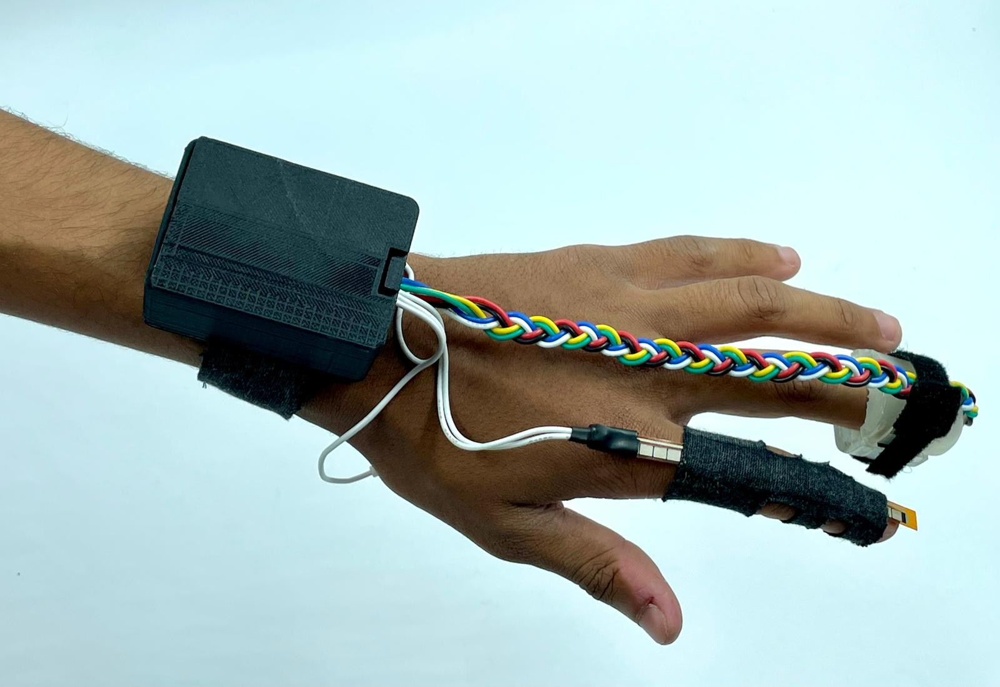

<p align="center">
    <h1>WanderingMind: Sensing the state of the user</h1>
    <h3>Xin Liu, Gershon Dublon, Clément Duhart, Thomas Juldo, Vincent Thevenin, Yliess Hati</h3>
</p>

<p align="center">
    
</p>

## Hardware

### Installation

To program the hardware, you first need the arduino IDE with the Esp32 board manager installed.<br/>

To do so, please follow this [tutorial](https://randomnerdtutorials.com/installing-the-esp32-board-in-arduino-ide-windows-instructions/)<br/>

### Usage

Simply plug the board, select the ESP32 Dev Module board in the IDE and finally upload the sketch present in the sensors_reading.ino folder to it.

## Software

### Installation

This software requires to have Processing with the Video libraries installed along with ffmpeg.<br/>
To install ffmpeg, simply use ```sudo apt install ffmpeg```<br/>
To install the Video libraries, simply browse the Processing library manager and install the `Video` library by The Processing Foundation and the `Video Export` by Abe Pazos.

### Usage

Once the board is plugged and the code was uploaded on it, you can simply launch the code in the serial_reading folder.<br/>

Be sure to check if the port name of the board is either "/dev/ttyUSB0" or "/dev/ttyUSB1". Else, you need to manually set it in the code by replacing ```port = new Serial(this, "/dev/ttyUSB0", 115200);``` with ```port = new Serial(this, "your port name", 115200);```